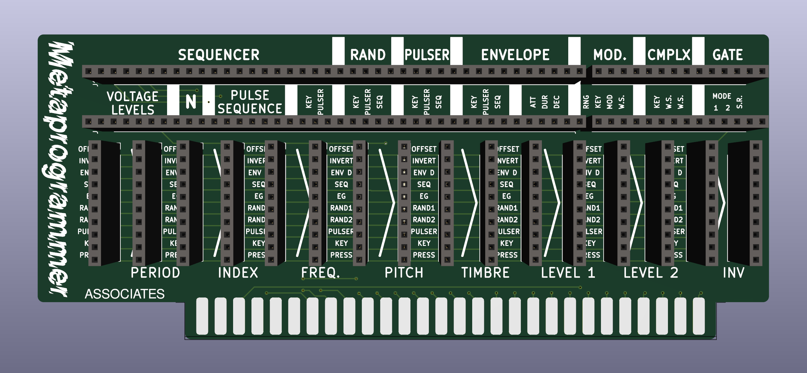

# Metaprogrammer
A 208 program card project

These Model 208 Program Cards are designed to interface with the “PROGRAM BOARD” edge connector of a Buchla & Associates Model 208 Stored Program Sound Source module and its reissues / compatible units. This is adapted from Dunnington Audio's KiCad project to provide standard 0.1" headers for prototyping, experimenting or re-programming.